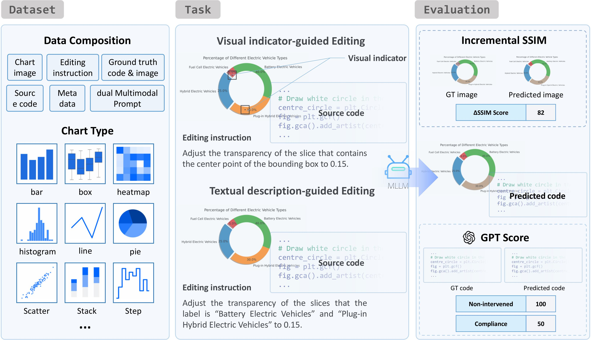

<div align="center">
<h1> ChartM³: Benchmarking Chart Editing with Multimodal Instructions
 </h1>
</div>

<div align="center">


</div>

<div align="center">
  <!-- <a href="#model">Model</a> • -->
  📚 <a href="https://huggingface.co/datasets/Colinyyy/ChartM3">Data</a> |
  📃 <a href="https://arxiv.org/abs/2507.21167">Paper</a>
</div>

## 🎉 What's New


- **[2025.07.04]** 🥳 ChartM³ is accepted by ACM Multimedia 2025.
- **[2025.07.07]** 📣 ChartM³ dataset is released on hugging face.

## 🎏 Introduction
Chart$\text{M}^3$ is a novel benchmark for multimodal chart editing, enabling fine-grained control over chart modifications through a combination of natural language and visual indicators. It includes 1,000 samples spanning varying levels of complexity and offers comprehensive evaluation metrics for both visual and code accuracy. 

Our work highlights significant limitations in existing multimodal models and demonstrates improvements through multimodal supervision.
<div align="center">

</div>

## 🚀 Quick Start

Here we provide a quick start guide to evaluate LMMs on ChartM$^3$.

### Setup Environment

```shell
conda env create -f environment.yaml
conda activate chartm3
```
### Download Data

You can download the whole evaluation data by running the following command:

```shell
cd ChartM3 # cd to the root directory of this repository
mkdir test_dataset
cd test_dataset
git clone https://huggingface.co/datasets/Colinyyy/ChartM3
```

To help researchers quickly understand evaluation data, we provide Dataset Viewer at Huggingface Dataset: 🤗 [ChartM3](https://huggingface.co/datasets/Colinyyy/ChartM3).

One example of evaluation data is as follows:

```
.
test_dataset
├── Bar
│ └── Bar_000ab8cfbd281c5b
│ │ ├── box_instruction.txt
│ │ ├── code_edit.py
│ │ ├── code.py
│ │ ├── Edit_figure.png
│ │ ├── Instruct.txt
│ │ ├── myplot.png
│ │ ├── Target_data.json
│ │ ├── textual_instruction.txt
│ │ └── Visual_figure.png
```
- box_instruction.txt: This file contains modification instructions that include visual indicators to guide the editing process.
- code_edit.py: This file contains the ground truth code for chart editing.

- code.py: This file contains the code used to generate the original chart.

- Edit_figure.png: This is the ground truth image of the chart after modifications have been applied.

- Instruct.txt: This file contains the initial instructions used during data construction.

- myplot.png: This file is the image of the original chart before any modifications.

- Target_data.json: This file specifies which objects in the chart should be modified and corresponds to the elements in the chart.

- textual_instruction.txt: This file contains modification instructions that do not include visual indicators.

- Visual_figure.png: This image is used as input when performing modifications with visual indicators.
  
We provide the test_dataset in ShareGPT format used under the experimental conditions, as seen in **test_dataset_box.json** and **test_dataset_text.json**.

### Evaluate Models
`python eval_ΔSSIM.py ./test_dataset.json   modle_output_path`

The model output should be organized in this format.
```
.
model_output_path
│ └── Bar_000ab8cfbd281c5b
│ │ ├── code.py
│ │ ├── Edit_figure.png
│ └── ...
```
- code.py: This file contains the code output by the model and used to generate the chart.

- Edit_figure.png: This is the image of the chart generated from the code.py after modifications have been applied by model.

example:
`python ./eval_ΔSSIM.py ./test_dataset.json ./example/qwen_box`

## 💬 Citation

If you find this repository useful, please consider giving star and citing our paper:

```
@article{yang2025chartm,
  author = {Donglu Yang and Liang Zhang and Zihao Yue and Liangyu Chen and Yichen Xu and Wenxuan Wang and Qin Jin},
  title = {ChartM³: Benchmarking Chart Editing with Multimodal Instructions},
  journal = {arXiv:2507.21167 [cs.CV]},
  year = {2025},
  url = {https://doi.org/10.48550/arXiv.2507.21167}
}

```
